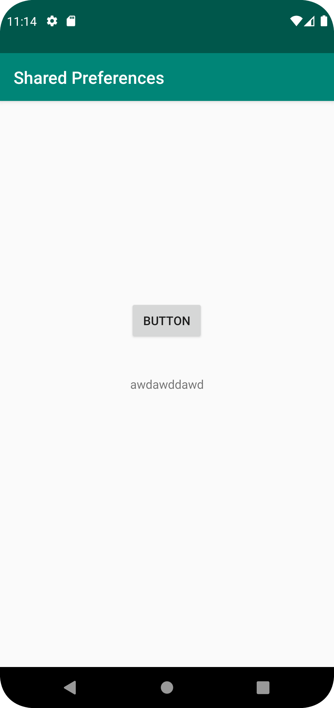
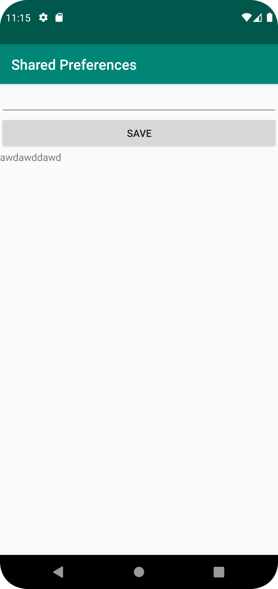

Först lades allt nödvändigt för shared preferences i mainactivity, sedan skapades en secondacivity där resten lades in. Efter detta skapades knappen för att skicka användaren till second activity, och sedan skapades de nödvändiga widgetsen i second activity för att skriva och spara text till första sidan. Första bilden visar main activity, andra bilden visar second activity. Koden visar de widgetsen i second activity.

```
    <EditText
        android:layout_width="match_parent"
        android:layout_height="wrap_content"
        android:id="@+id/settingseditview"
        app:layout_constraintTop_toTopOf="parent"/>
    <Button
        android:text="@string/save"
        android:layout_below="@+id/settingseditview"
        android:layout_width="match_parent"
        android:layout_height="wrap_content"
        android:id="@+id/prefButton"
        android:onClick="savePref"
        app:layout_constraintTop_toBottomOf="@+id/settingseditview"
        />
    <TextView
        android:layout_below="@+id/prefButton"
        android:layout_width="match_parent"
        android:layout_height="wrap_content"
        android:id="@+id/prefText"
        app:layout_constraintTop_toBottomOf="@+id/prefButton"/>
```


